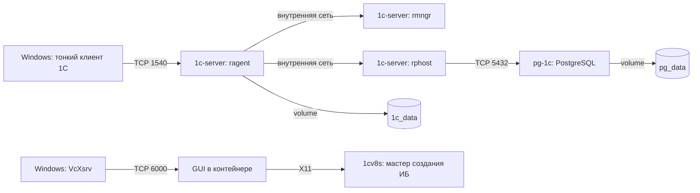

# 01. Введение и техническое описание

**Навигация:** [Содержание](README.md) | [Следующий →](02-vm-setup.md)

---

## 📌 О чём этот раздел

Здесь описано:
- Что представляет собой стенд
- Зачем его разворачивать
- Какая архитектура используется
- Что нужно подготовить перед началом

---

## 🎯 Что такое этот стенд

Это **полностью контейнеризованный стенд** для работы с **1С:Предприятие 8.3**, развёрнутый на **одной виртуальной машине** Ubuntu.

**Основная идея:** всё, что нужно для разработки и отладки решений на 1С, работает в **Docker-контейнерах**:

- **СУБД PostgreSQL** — в контейнере `pg-1c`
- **Сервер 1С:Предприятие** — в контейнере `1c-server`
- **Данные** — в Docker Volumes (сохраняются между перезапусками)

Это даёт:
- **Изоляцию** — компоненты не мешают друг другу
- **Воспроизводимость** — можно пересобрать с нуля за минуты
- **Переносимость** — работает на любой Linux-машине с Docker
- **Лёгкость резервного копирования** — volume + `pg_dump`

---

## 💼 Польза практического применения

### Для 1С-франчайзи (реальный кейс)

**Проблема:** у каждого разработчика — своя «песочница», настроенная вручную. Различия в версиях, конфигурациях, окружениях приводят к «а у меня работает».

**Решение:** контейнеризованный стенд, который **воспроизводится одинаково** на любой машине. Разработчик получает **чистое окружение** за 10 минут, а не за 2 дня.

### Для обучения и сертификации

- **Единый учебный стенд** для группы студентов
- **Простая раздача** — образ + compose-файл
- **Легко сбросить** — удалил volume, развернул заново

### Для тестирования и CI/CD

- **Автотесты конфигураций** — развернул стенд, прогнал тесты, убил
- **Интеграция с GitLab CI / GitHub Actions** — образ легко встраивается в pipeline
- **Нагрузочное тестирование** — можно масштабировать через Docker

### Для разработки

- **Локальная разработка** — изолированное окружение на ноутбуке
- **Несколько проектов одновременно** — разные контейнеры, разные порты
- **Быстрый откат** — пересоздал контейнер, вернулся к чистому состоянию

---

## 🏗️ Архитектура стенда

### Общая схема

```
┌────────────────────────────────────────────────────────────────┐
│  Windows-хост (192.168.0.129)                                  │
│                                                                │
│  ┌────────────────────────┐   ┌──────────────────────────────┐ │
│  │  Тонкий клиент 1С      │   │  VcXsrv (X-сервер)           │ │
│  │  (для подключения     │   │  TCP :6000                   │ │
│  │   к серверу)           │   │  (для GUI в контейнере)      │ │
│  └───────────┬────────────┘   └──────────────┬───────────────┘ │
│              │                               │                 │
│  ┌───────────▼────────────┐   ┌──────────────▼───────────────┐ │
│  │  MobaXterm             │   │  Хост-файл hosts             │ │
│  │  (SSH-клиент, X11)     │   │  192.168.0.173 ...           │ │
│  └───────────┬────────────┘   └──────────────────────────────┘ │
└──────────────┼─────────────────────────────────────────────────┘
               │
               │ TCP: 22 (SSH), 5432 (PG), 1540-1541 (1C), 6000 (X11)
               ▼
┌────────────────────────────────────────────────────────────────┐
│  Ubuntu VM (192.168.0.173)                                     │
│  VirtualBox, «Сетевой мост»                                    │
│                                                                │
│  ┌──────────────────────────────────────────────────────────┐  │
│  │  Docker Engine + Compose                                 │  │
│  │                                                          │  │
│  │  Сеть: 1c-net (bridge)                                   │  │
│  │                                                          │  │
│  │  ┌────────────────────────┐   ┌───────────────────────┐  │  │
│  │  │  Контейнер pg-1c       │   │  Контейнер 1c-server  │  │  │
│  │  │  PostgreSQL 15.17-1.1C │◄──┤  1C Server 8.3.26     │  │  │
│  │  │  Порт: 5432            │   │  Порты: 1540/1541     │  │  │
│  │  │  Volume: pg_data       │   │  Volume: 1c_data      │  │  │
│  │  └────────────────────────┘   └───────────────────────┘  │  │
│  │                                                          │  │
│  │  Volumes: pg_data, 1c_data, 1c_logs                      │  │
│  └──────────────────────────────────────────────────────────┘  │
└────────────────────────────────────────────────────────────────┘
```

### Поток данных



### Сетевые порты

| Порт | Компонент | Назначение | Доступ |
|---|---|---|---|
| **22** | SSH | Удалённое управление VM | Windows → VM |
| **5432** | PostgreSQL | СУБД | Windows, 1c-server → pg-1c |
| **1540** | ragent | Центральный сервер 1С | Windows → 1c-server |
| **1541** | rmngr | Менеджер кластера | Windows → 1c-server |
| **1560-1591** | rphost | Рабочие процессы | — |
| **6000** | VcXsrv | X11 для GUI | VM → Windows |

### Volumes Docker

| Volume | Монтируется в | Что хранит |
|---|---|---|
| `pg_data` | `/var/lib/postgresql/data` | Все базы PostgreSQL |
| `1c_data` | `/home/usr1cv8` | Данные сервера 1С (кластер, snccntx, логи) |
| `1c_logs` | `/home/usr1cv8/.1cv8/1C/1cv8/logs` | Технологические логи 1С |

**Важно:** удаление volume = удаление данных. **Не делайте `docker compose down -v`** без необходимости.

---

## 🧩 Компоненты стенда

### 1. PostgreSQL 15.17-1.1C

**Что это:** официальная сборка PostgreSQL от 1С с расширениями:
- `mchar` — хранение строк переменной длины в формате 1С
- `fasttrun` — быстрый TRUNCATE

**Зачем нужна 1С-сборка:** ванильный PostgreSQL из Docker Hub **не содержит** этих расширений. Без них 1С отказывается создавать ИБ.

### 2. Сервер 1С:Предприятие 8.3.26.1540

**Что это:** кластер серверов 1С, включает:
- **`ragent`** — центральный сервер (порт 1540)
- **`rmngr`** — менеджер кластера (порт 1541)
- **`rphost`** — рабочие процессы (диапазон 1560-1591)
- **Search server** — сервер поиска (новый компонент 8.3.26)

**Ключевое:** сервер работает **отдельно** от СУБД. Он подключается к PostgreSQL по сети.

### 3. Community-лицензия

**Что это:** бесплатная лицензия 1С для разработчиков.

**Лимиты:**
- До **3 сеансов** с прямым подключением
- До **1 сеанса** через веб-сервер
- До **1 сеанса** мобильного клиента

**Особенность:** привязана к **MAC-адресу контейнера**. Пересоздание контейнера = потеря лицензии.

### 4. X11 через TCP

**Зачем:** 1С-сервер работает headless (без графики), но для **активации лицензии** и **создания ИБ** нужен GUI.

**Решение:** X-сервер (VcXsrv) на Windows → TCP-порт 6000 → контейнер 1С отправляет графику на Windows.

### 5. Тонкий клиент 1С на Windows

**Зачем:** пользователи подключаются к серверу 1С **с Windows-машин**, как к обычному серверу 1С.

---

## 📋 Что нужно подготовить

### Оборудование

- **Windows-хост** с минимум:
  - 16 ГБ ОЗУ (из них 8 ГБ для VM)
  - 100 ГБ свободного места на диске
  - Ethernet-подключение к локальной сети
- **Свободный IP** в локальной сети для VM (например, `192.168.0.173`)

### Программное обеспечение

На Windows:
- **VirtualBox** 7.x — [скачать](https://www.virtualbox.org/)
- **VcXsrv** — [скачать](https://sourceforge.net/projects/vcxsrv/)
- **MobaXterm** — [скачать](https://mobaxterm.mobatek.net/)
- **Тонкий клиент 1С 8.3.26.1540** — с `releases.1c.ru`

На Ubuntu VM:
- **Ubuntu 24.04 LTS** (Server или Desktop) — [скачать](https://ubuntu.com/download)

### Доступы

- **`releases.1c.ru`** — для скачивания дистрибутивов 1С и PostgreSQL
- **`developer.1c.ru`** — для получения Community-лицензии

---

## 🗺️ Что дальше

Следующий раздел — [**02. Настройка виртуальной машины**](02-vm-setup.md).

Там мы:
1. Создадим VM в VirtualBox
2. Установим Ubuntu
3. Скачаем дистрибутивы 1С и PostgreSQL

---

**Навигация:** [Содержание](README.md) | [Следующий →](02-vm-setup.md)
